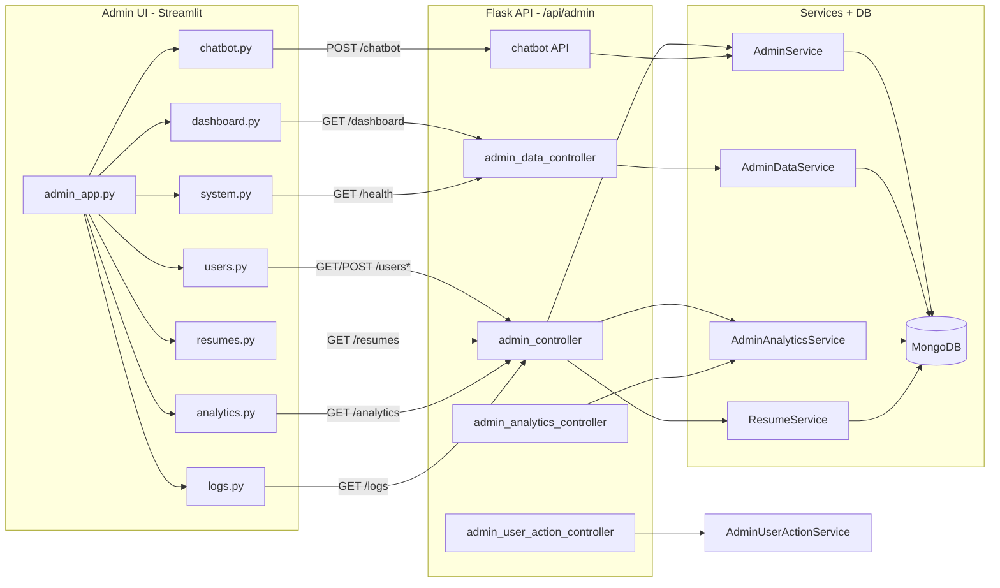

# Admin Section – Complete Documentation

This document is the single reference for the **admin** area: which files do what, how they work together, and the proper flow.

---

## 1. High-Level Architecture

The admin area has **two parts**:

| Part          | Tech                                                                  | Purpose                                                |
| ------------- | --------------------------------------------------------------------- | ------------------------------------------------------ |
| **Admin UI**  | Streamlit (`admin/`)                                                  | Login, sidebar navigation, pages that call the backend |
| **Admin API** | Flask (`Python/Controller/`, `Python/api/admin/`, `Python/services/`) | REST endpoints and business logic                      |

The Streamlit app runs separately (e.g. `streamlit run admin/admin_app.py`) and talks to the Flask app at `http://127.0.0.1:5000/api/admin`.



---

## 2. Admin UI (Streamlit) – File by File

All under **admin/**. Entry point is **admin/admin_app.py**.

### admin/admin_app.py

- **Role:** Single Streamlit app: session state, login screen, auth gate, sidebar, routing.
- **Flow:**
  1. Ensures `st.session_state.admin` exists (init to `None`).
  2. If not logged in: shows **login form** → `POST /api/admin/login` (email/password) → on success stores `data["admin"]` in session and reruns.
  3. If still no admin: stops (login only).
  4. Renders sidebar: admin name, Logout (clears `admin`, rerun), and **radio menu**: Dashboard, Users, Resumes, Analytics, Chatbot, System, Logs.
  5. According to menu choice, calls one of the section page functions below, passing `API_BASE = "http://127.0.0.1:5000/api/admin"`.

### admin/utils/api.py

- **Role:** Thin helper: `get(path)` does `GET BASE_URL + path` and returns JSON. Not used by all sections (some use `requests` directly with `api_base`).

### admin/sections/dashboard.py

- **Role:** Dashboard page.
- **Flow:** `GET {api_base}/dashboard` → expects `{ total_users, total_resumes, total_feedbacks, providers }` → shows 3 metrics and a bar chart (users by provider).
- **Backend:** Handled by **admin_data_controller** (`GET /dashboard`) → **AdminDataService.dashboard()**.

### admin/sections/users.py

- **Role:** User management page.
- **Flow:**
  1. `GET {api_base}/users` → list of users (email, name, provider, role, status).
  2. For each user: expander with Block / Unblock / Delete buttons → `POST .../users/block`, `.../users/unblock`, `.../users/delete` with `{"email": "..."}`.
  3. `GET {api_base}/users/export` → CSV download.
- **Backend:** Users list and export from **admin_controller**; block/unblock/delete from **admin_controller** (and duplicate routes in **admin_user_action_controller**; Flask resolves by registration order).

### admin/sections/resumes.py

- **Role:** Resumes list and export.
- **Flow:** `GET {api_base}/resumes` → expects `{ success, data: [{ email, title, created_at }, ...] }` → metrics, dataframe, expanders, then `GET .../resumes/export` for CSV.
- **Backend:** **admin_controller** (`/resumes`, `/resumes/export`) → **ResumeService.get_all_resumes_for_admin()**.

### admin/sections/analytics.py

- **Role:** Analytics and charts.
- **Flow:** `GET {api_base}/analytics` with header `X-Admin-Email: st.session_state.admin["email"]` → uses `users_over_time`, `resumes_over_time`, `top_users` → Plotly line/bar charts.
- **Backend:** **admin_controller** (`GET /analytics`) → **AdminAnalyticsService.get_analytics()** (decodes top user emails for display).

### admin/sections/chatbot.py

- **Role:** Chat UI for admin Q&A.
- **Flow:** Keeps `st.session_state.chat_history`. On user message → `POST {api_base}/chatbot` with `{"question": "..."}` and `X-Admin-Email` → displays answer and optional build/mode caption.
- **Backend:** **api/admin/chatbot** (`POST /chatbot`) → rule-based + optional OpenAI; checks admin via **AdminService.is_admin(email)**.

### admin/sections/system.py

- **Role:** System health page.
- **Flow:** `GET {api_base}/health` → expects dict like `{ flask, mongo, redis }` → shows success messages.
- **Backend:** **admin_data_controller** (`GET /health`) → **AdminDataService.health()**.

### admin/sections/logs.py

- **Role:** Activity logs viewer.
- **Flow:** Select log type (admin / service) → "Refresh Logs" → `GET {api_base}/logs?type={log_type}` → displays `logs` array in a text area.
- **Backend:** **admin_controller** (`GET /logs`) → reads last 200 lines from allowed log file (admin.log, service.log, etc.).

### admin/sections/log.py

- **Role:** Unused. Contains a standalone `logs_page()` with mock data. The app uses **logs.py** (API-backed), not **log.py**.

---

## 3. Backend (Flask) – Controllers and Services

### Controllers (all under `/api/admin` via Python/app.py)

| Blueprint                | File                                                                  | Routes                                                                                                                                                               | Purpose                                                                                                                |
| ------------------------ | --------------------------------------------------------------------- | -------------------------------------------------------------------------------------------------------------------------------------------------------------------- | ---------------------------------------------------------------------------------------------------------------------- |
| **admin_bp**             | Python/Controller/admin_controller.py                                | GET /resumes, GET /analytics, GET /users, POST /users/block, POST /users/unblock, POST /users/delete, POST /login, GET /users/export, GET /resumes/export, GET /logs | Main admin API: resumes, analytics, users CRUD, login, CSV exports, log file content                                   |
| **admin_data_bp**        | Python/Controller/admin_data_controller.py                           | GET /dashboard, GET /users, GET /resumes, GET /health                                                                                                                | Dashboard counts, optional users/resumes, health check                                                                 |
| **admin_analytics_bp**   | Python/Controller/admin_analytics_controller.py                       | GET /analytics                                                                                                                                                       | Alternative analytics endpoint (same prefix; admin_bp registered first so its /analytics is the one used by Streamlit) |
| **admin_user_action_bp** | Python/Controller/admin_user_action_controller.py                     | POST /users/block, POST /users/unblock, POST /users/delete                                                                                                           | User actions (overlap with admin_bp; first registered wins)                                                            |
| **chatbot_bp**           | Python/api/admin/chatbot.py                                          | POST /chatbot                                                                                                                                                        | Natural-language Q&A; requires `X-Admin-Email`; rule-based + OpenAI                                                    |

Registration order in **app.py**: `admin_bp` → `admin_data_bp` → `admin_analytics_bp` → `admin_user_action_bp` → `chatbot_bp`. So for overlapping routes (e.g. `/users`, `/analytics`), **admin_controller** is the one that actually serves the Streamlit app.

### Services

| Service                    | File                                              | Role                                                                                                                                         |
| -------------------------- | ------------------------------------------------- | -------------------------------------------------------------------------------------------------------------------------------------------- |
| **AdminService**           | Python/services/admin_service.py                  | get_all_users (decode local emails/names), block_user, unblock_user, delete_user, login_admin (email/password + role check), is_admin(email) |
| **AdminDataService**       | Python/services/admin_data_service.py             | dashboard() (counts + providers), users(), resumes() (aggregation), health()                                                                 |
| **AdminAnalyticsService**  | Python/services/admin_analytics_service.py        | get_analytics() → users_over_time, resumes_over_time, top_users (MongoDB aggregations)                                                       |
| **AdminUserActionService** | Python/services/admin_user_action_service.py      | block_user, unblock_user, delete_user (used by admin_user_action_controller)                                                                 |
| **ResumeService**          | Python/services/resume_service.py                 | get_all_resumes_for_admin() → list of { email, title, created_at } (decoded)                                                                 |

Admin chatbot (Python/api/admin/chatbot.py) uses **AdminService** for `is_admin()`, and **db** (MongoDB) for read-only rule-based answers (counts, feedbacks, etc.) and optional OpenAI fallback.

---

## 4. End-to-End Request Flow (How It Works)

```mermaid
sequenceDiagram
    participant User
    participant Streamlit as Streamlit Admin UI
    participant Flask as Flask App
    participant AdminCtrl as admin_controller
    participant DataCtrl as admin_data_controller
    participant Chatbot as chatbot API
    participant AdminSvc as AdminService
    participant DataSvc as AdminDataService
    participant AnalyticsSvc as AdminAnalyticsService
    participant ResumeSvc as ResumeService
    participant DB as MongoDB

    User->>Streamlit: Open admin app
    Streamlit->>Streamlit: Check session_state.admin
    alt Not logged in
        Streamlit->>User: Show login form
        User->>Streamlit: Email + password
        Streamlit->>Flask: POST /api/admin/login
        Flask->>AdminCtrl: admin_login()
        AdminCtrl->>AdminSvc: login_admin(email, password)
        AdminSvc->>DB: find user, check role & password
        DB-->>AdminSvc: user
        AdminSvc-->>AdminCtrl: { success, admin }
        AdminCtrl-->>Streamlit: 200 + admin payload
        Streamlit->>Streamlit: Set session_state.admin, rerun
    end

    User->>Streamlit: Choose "Dashboard"
    Streamlit->>Flask: GET /api/admin/dashboard
    Flask->>DataCtrl: dashboard()
    DataCtrl->>DataSvc: dashboard()
    DataSvc->>DB: count users, resumes, feedbacks; group by provider
    DB-->>DataSvc: data
    DataSvc-->>DataCtrl: dict
    DataCtrl-->>Streamlit: JSON
    Streamlit->>User: Metrics + bar chart

    User->>Streamlit: Choose "Users"
    Streamlit->>Flask: GET /api/admin/users
    Flask->>AdminCtrl: get_users()
    AdminCtrl->>AdminSvc: get_all_users()
    AdminSvc->>DB: find all users (decode local)
    DB-->>AdminSvc: users
    AdminSvc-->>Streamlit: user list
    Streamlit->>User: Table + Block/Unblock/Delete

    User->>Streamlit: Choose "Resumes"
    Streamlit->>Flask: GET /api/admin/resumes
    Flask->>AdminCtrl: get_all_resumes_admin()
    AdminCtrl->>ResumeSvc: get_all_resumes_for_admin()
    ResumeSvc->>DB: find all resumes (decode email)
    DB-->>ResumeSvc: resumes
    ResumeSvc-->>Streamlit: { success, data }
    Streamlit->>User: Dataframe + CSV export

    User->>Streamlit: Choose "Analytics"
    Streamlit->>Flask: GET /api/admin/analytics (X-Admin-Email)
    Flask->>AdminCtrl: get_analytics()
    AdminCtrl->>AnalyticsSvc: get_analytics()
    AnalyticsSvc->>DB: aggregations (users/resumes over time, top users)
    DB-->>AnalyticsSvc: data
    AdminCtrl->>AdminCtrl: decode top_users emails
    AdminCtrl-->>Streamlit: JSON
    Streamlit->>User: Plotly charts

    User->>Streamlit: Choose "Chatbot" + type question
    Streamlit->>Flask: POST /api/admin/chatbot (X-Admin-Email, question)
    Flask->>Chatbot: chatbot route
    Chatbot->>AdminSvc: is_admin(email)
    Chatbot->>DB: rule-based read / optional OpenAI
    Chatbot-->>Streamlit: { answer } + headers
    Streamlit->>User: Answer in chat

    User->>Streamlit: Choose "System"
    Streamlit->>Flask: GET /api/admin/health
    Flask->>DataCtrl: health()
    DataCtrl->>DataSvc: health()
    DataSvc-->>Streamlit: { flask, mongo, redis }
    Streamlit->>User: Health status

    User->>Streamlit: Choose "Logs" + type + Refresh
    Streamlit->>Flask: GET /api/admin/logs?type=admin|service
    Flask->>AdminCtrl: get_logs()
    AdminCtrl->>AdminCtrl: resolve log path, read last 200 lines
    AdminCtrl-->>Streamlit: { logs: [...] }
    Streamlit->>User: Text area with log lines
```

---

## 5. Summary Table – "Which file does what"

| What                                                            | Where                                               |
| --------------------------------------------------------------- | --------------------------------------------------- |
| Run admin UI                                                    | `streamlit run admin/admin_app.py`                  |
| Login, sidebar, routing                                         | admin/admin_app.py                                  |
| Dashboard (counts, providers chart)                             | admin/sections/dashboard.py → GET /dashboard        |
| Users list, block/unblock/delete, CSV                           | admin/sections/users.py → admin_controller          |
| Resumes list + CSV export                                       | admin/sections/resumes.py → admin_controller        |
| Analytics charts                                                | admin/sections/analytics.py → admin_controller      |
| Chatbot UI                                                      | admin/sections/chatbot.py → POST /chatbot           |
| System health                                                   | admin/sections/system.py → GET /health              |
| Logs viewer                                                     | admin/sections/logs.py → GET /logs                  |
| Main admin API (resumes, analytics, users, login, export, logs) | Python/Controller/admin_controller.py              |
| Dashboard & health API                                          | Python/Controller/admin_data_controller.py          |
| Admin chatbot (rules + OpenAI)                                  | Python/api/admin/chatbot.py                         |
| User list, auth, block/unblock/delete                           | Python/services/admin_service.py                    |
| Dashboard counts, health                                        | Python/services/admin_data_service.py               |
| Analytics aggregations                                          | Python/services/admin_analytics_service.py          |
| Resumes for admin list/export                                   | Python/services/resume_service.py                   |

---

## 6. Dummy Data for Analytics Charts

To get realistic **Analytics** charts (users over time, resumes over time, top users), you can wipe the DB and seed dummy data with **varied timestamps** (spread over the last 45 days).

**Run from project root:**

```bash
# Bash / cmd
cd Python && python scripts/seed_dummy_data.py

# PowerShell
cd Python; python scripts/seed_dummy_data.py
```

This script:

1. **Clears** all documents in `users`, `resumes`, and `feedbacks`.
2. **Creates one admin user** so you can still log in: `admin@gmail.com` / `Admin123!@#` (change password after first login if needed).
3. **Inserts** ~15 dummy users (mix of local and Google), ~25–60 resumes, and 15 feedbacks, with `created_at` spread over the last 45 days.

Charts will show proper time series and top users. See **docs/SEED_DATA.md** for details.

---

## 7. Note on Duplicate Routes

**admin_controller** and **admin_data_controller** both expose GET `/users` and GET `/resumes`; **admin_controller** and **admin_analytics_controller** both expose GET `/analytics`; **admin_controller** and **admin_user_action_controller** both expose POST `/users/block`, `/users/unblock`, `/users/delete`. Because **admin_bp** is registered first, the Streamlit app effectively uses **admin_controller** for those overlapping routes. The other blueprints are either used for distinct routes (e.g. /dashboard, /health) or are redundant under the current registration order.
