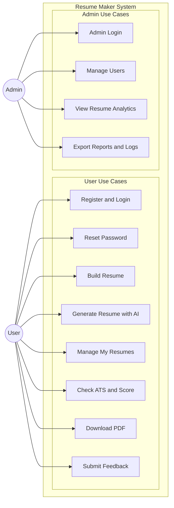
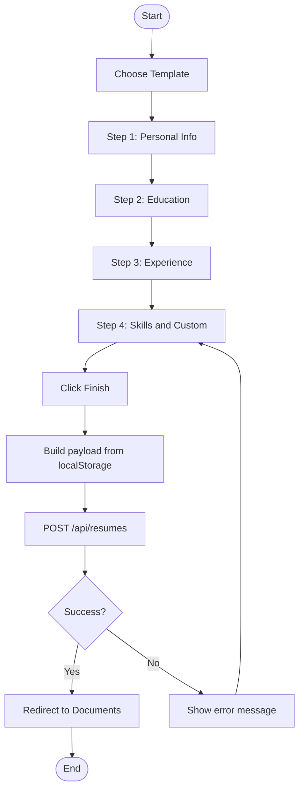
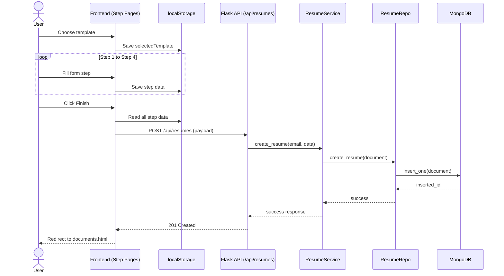
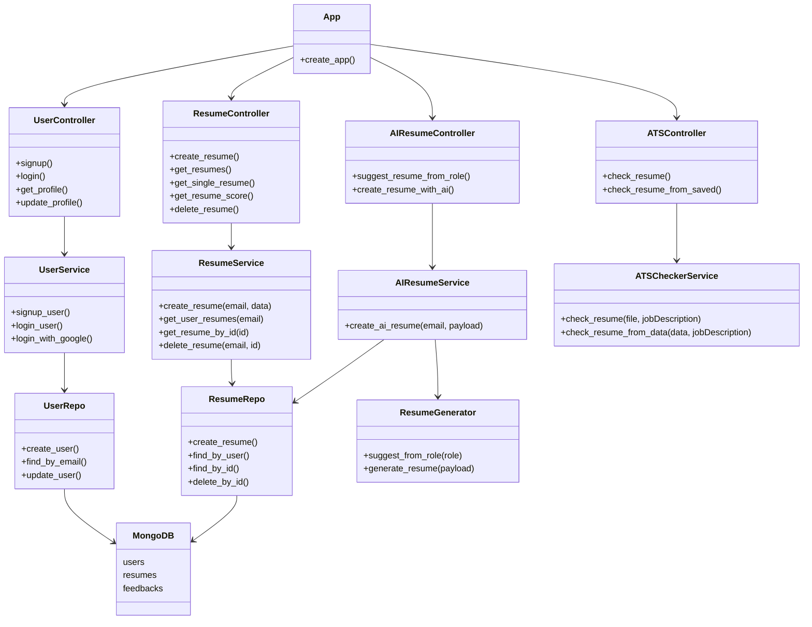
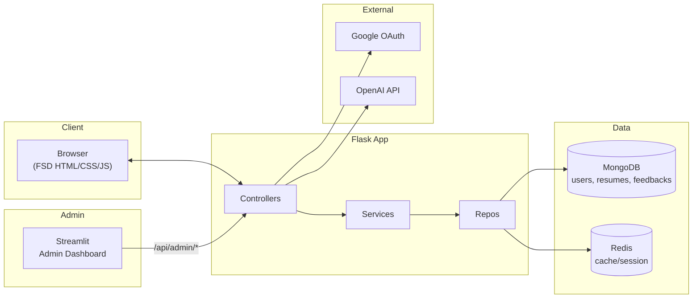
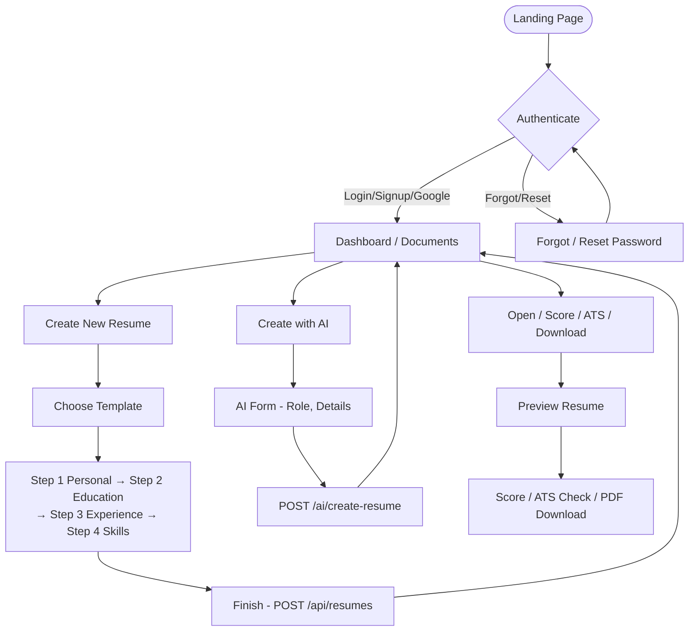
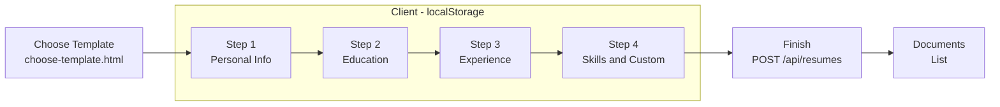
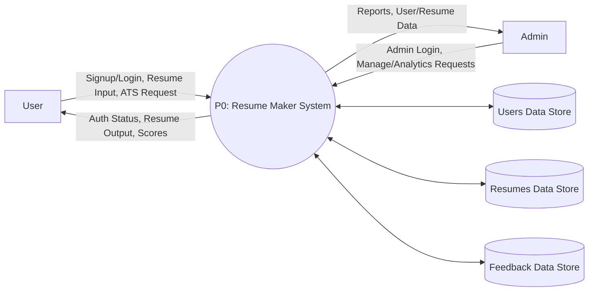
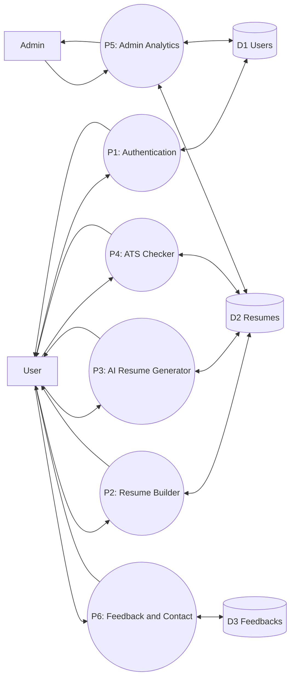
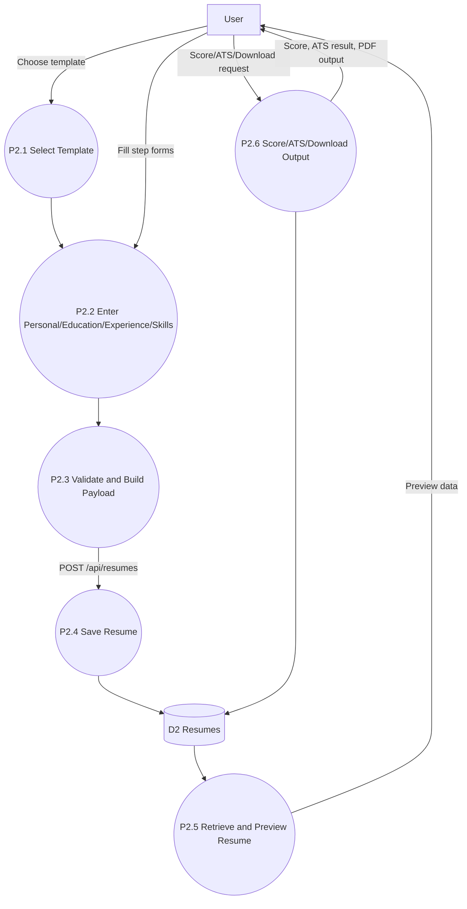

# SRS Diagrams for Resume Maker PPT

Ten diagrams for your Software Requirements Specification and PowerPoint. Each diagram is compact and fits on one slide. Use the instructions at the bottom to export as images.

---

## 1. Use Case Diagram

Clean, compact version for PPT: grouped use cases with fewer nodes and clearer labels.

**Tip:** In Mermaid Live, use a large zoom (e.g. 150–200%) or export as **SVG** for sharp text in PPT. If using PNG, choose the highest scale for a clear look.

---

## 2. Activity Diagram

Flow of activities for creating a resume manually: from template choice through steps to save. Decisions show success/failure and optional return to edit.

---

## 3. Sequence Diagram

Interaction flow for manual resume creation from UI steps to backend save and final redirect.

---

## 4. Class Diagram

Core backend class/module structure for authentication, resume operations, AI generation, and ATS analysis.

---

## 5. System Architecture (High-Level)

Shows: Browser (FSD static), Flask app (Controllers → Services → Repos), MongoDB/Redis, Admin (Streamlit), and external services (Google OAuth, OpenAI).

---

## 6. User Flow

End-to-end user journey: Landing → Auth → Dashboard → Create New, Create with AI, or Open/Score/ATS/Download.

---

## 7. Resume Creation Process (Step-by-Step)

Linear flow for "Create New Resume": template selection through save.

---

## 8. 4.5 Data Flow Diagram

### 4.5.1 Level-0 DFD

Context-level view: external actors interact with one main process.

### 4.5.2 Level-1 DFD

Decomposition of P0 into major processes.

### 4.5.3 Level-2 DFD

Detailed decomposition of **P2: Resume Builder**.

---

## How to Use in PPT

- **Option A:** Paste each Mermaid code block into [Mermaid Live Editor](https://mermaid.live), then use **Download PNG** or **Download SVG**. Insert the image into a slide (one diagram per slide).
- **Option B:** In VS Code or Cursor, install a Mermaid extension (e.g. "Mermaid Preview"), open this file, preview, and export as image.
- **Option C:** For Word or Google Docs SRS, export each diagram as PNG from Mermaid Live and insert as picture.

One diagram per slide keeps text and boxes readable in your presentation.
